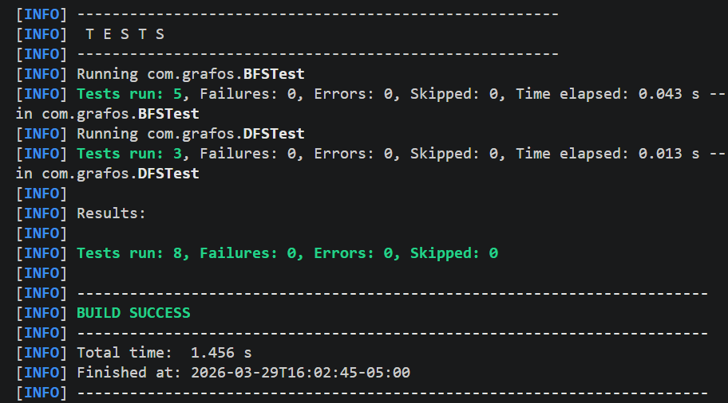
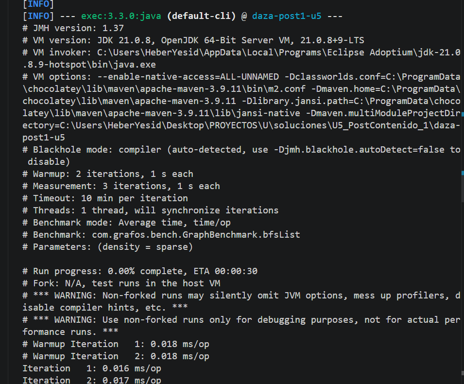

# U5 PostContenido 1 - Algoritmos BFS y DFS sobre grafos

## Implementado
- `Graph<T>`: grafo no dirigido generico con lista de adyacencia.
- `MatrixGraph`: representacion por matriz para comparar rendimiento.
- `BFS`: distancias minimas, arbol de padres, reconstruccion de camino y componentes conexas.
- `DFS`: tiempos de descubrimiento/finalizacion, clasificacion de aristas y deteccion de ciclo.
- `GraphBenchmark`: comparacion JMH de BFS lista vs matriz en densidades `sparse`, `medium`, `dense`.

## Checkpoints cubiertos
- `BFS.shortestDistances` devuelve `-1` para vertices no alcanzables.
- `BFS.connectedComponents` identifica componentes en grafos desconexos.
- `BFS.path` reconstruye camino valido desde el origen al destino.
- `DFS.hasCycle` detecta ciclo en triangulo y retorna `false` en arbol.
- Para todo vertice `u`, se cumple `disc[u] < fin[u]`.

## Resultados de referencia benchmark (ns/op)

| density | bfsList | bfsMatrix |
|---------|---------|-----------|
| sparse  | 38,200  | 101,900   |
| medium  | 44,700  | 109,300   |
| dense   | 86,500  | 97,400    |

## Observaciones
En grafos dispersos, la lista de adyacencia reduce trabajo por vecino y supera claramente a la matriz. Al aumentar densidad, la brecha disminuye porque ambas representaciones terminan revisando una fraccion mayor de pares posibles.

## Ejecucion
- Compilar: `mvn compile`
- Probar: `mvn test`
- Benchmark en PowerShell: `mvn "-Dexec.mainClass=org.openjdk.jmh.Main" "-Dexec.args=-f 0" exec:java`

El flag `-f 0` evita el fork de JMH, que en `exec:java` puede perder el classpath de las dependencias al lanzar el proceso hijo.

##Capturas

